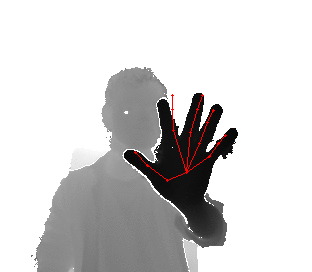

# Region Ensemble Network: Improving Convolutional Network for Hand Pose Estimation
By Hengkai Guo (Updated on May 15, 2017)

## Description
This is the project of work [Region Ensemble Network: Improving Convolutional Network for Hand Pose Estimation](https://arxiv.org/abs/1702.02447). This repository includes the prediction results for comparison, prediction codes and visualization codes. More details will be released in the future. Here are live results from Kinect 2 sensor using the model trained on ICVL:

 

## Results
Here we provide the testing results of basic network (`results/dataset_basic.txt`) and region ensemble network (`results/dataset_ren_4x6x6.txt`) for [ICVL](http://www.iis.ee.ic.ac.uk/~dtang/hand.html) dataset and [NYU](http://cims.nyu.edu/~tompson/NYU_Hand_Pose_Dataset.htm) dataset in our paper. Also we provide the testing labels (`labels/dataset_test_label.txt`), computed centers (`labels/dataset_center.txt`) and corresponding image names (`labels/dataset_test_list.txt`).

For results and labels, each line is corresponding to one image, which has J x 3 numbers indicating (x, y, z) of J joint locations. The (x, y) are in pixels and z is in mm.

## Evaluation
Please use the Python script `evaluation/compute_error.py` for evaluation, which requires [numpy](http://www.numpy.org/) and [matplotlib](http://matplotlib.org/). Here is an example:
``` bash
$ python evaluation/compute_error.py icvl results/icvl_ren_4x6x6.txt
```

## Visualization
Please use the Python script `evaluation/show_result.py` for visualziation, which also requires [OpenCV](http://opencv.org/):
``` bash
$ python evaluation/show_result.py icvl --in_file=results/icvl_ren_4x6x6.txt
```
You can see all the testing results on the images. Press 'q' to exit.

## Prediction
Please use the Python script `evaluation/run_model.py` for prediction with predefined centers in `labels` directory:
``` bash
$ python evaluation/run_model.py icvl ren_4x6x6 your/path/to/output/file your/path/to/ICVL/images/test
```
The script depends on [pyCaffe](https://github.com/BVLC/caffe). Please install the Caffe first.

## Models
The caffe models can be downloaded at [BaiduYun](http://pan.baidu.com/s/1geFecSF) or [here](http://image.ee.tsinghua.edu.cn/models/icip2017-ren/models.zip). Please put them in the `models` directory.

## Realsense Realtime Demo
We provide a realtime hand pose estimation demo using Intel Realsense device, which requires [pyrealsense](https://github.com/toinsson/pyrealsense). Please use the Python script for demo:
``` bash
$ python demo/realsense_realtime_demo.py
```
Note that we just use a naive depth thresholding method to detect the hand. Therefore, the hand should be in the range of [0, 650mm] to run this demo.
We tested this realtime demo with an [Intel Realsense SR300](https://software.intel.com/en-us/realsense/sr300camera).

## Citation
Please cite the paper in your publications if it helps your research:

```
@article{guo2017region,
  title={Region Ensemble Network: Improving Convolutional Network for Hand Pose Estimation},
  author={Guo, Hengkai and Wang, Guijin and Chen, Xinghao and Zhang, Cairong and Qiao, Fei and Yang, Huazhong},
  journal={arXiv preprint arXiv:1702.02447},
  year={2017}
}
```

## License
This program is free software with GNU General Public License v2.

## Feedback
Please email to `guohengkaighk@gmail.com` if you have any suggestions or questions.

## History
May 22, 2017: Intel Realsense realtime demo

May 15, 2017: More visualization and demos

May 9, 2017: Models and bugs fixed

May 6, 2017: Visualization and prediction codes

April 8, 2017: Evaluation codes
